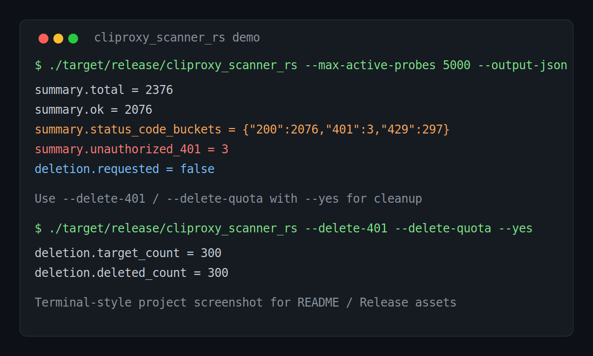

# cliproxy_scanner_rs

[](https://github.com/Johnhezergez/cliproxy_scanner_rs/releases)
[](https://github.com/Johnhezergez/cliproxy_scanner_rs/actions/workflows/ci.yml)
[](LICENSE)

A CLI Proxy API cleanup tool for identifying and removing invalid and quota-limited auth files.

一个用于清理 CLI Proxy API 失效与限额 auth 的脚本 / 工具。

## Overview / 项目概览

This project is designed for operational cleanup of Codex-related auth files managed behind a CLI Proxy API.

It focuses on three jobs:

1. List Codex auth files from the management endpoint
2. Probe each auth file through `/v0/management/api-call`
3. Summarize status distribution and optionally delete invalid (`401`) and quota-limited (`429`) entries

这个项目面向运维清理场景，主要针对 CLI Proxy API 后面的 Codex auth files。

核心能力：

1. 从 management endpoint 拉取 Codex auth files
2. 通过 `/v0/management/api-call` 主动探测每个 auth file
3. 汇总状态分布，并可选删除失效（`401`）与限额（`429`）条目

## Features / 功能

- Lists auth files from `/v0/management/auth-files`
- Filters to Codex-related auth entries
- Probes tokens via `/v0/management/api-call` using `auth_index`
- Detects invalid / revoked auth (`401`)
- Detects quota-limited auth (`429`, `usage_limit_reached`, weekly/quota markers)
- Summarizes totals, buckets, and reasons in JSON
- Optionally deletes:
  - invalid auths: `--delete-401 --yes`
  - quota-limited auths: `--delete-quota --yes`
- Supports retries, timeouts, parallel workers, and JSON file output
- Includes basic safety rails for probe URL / host validation

中文说明：

- 拉取 `/v0/management/auth-files` 中的 auth 文件
- 自动过滤 Codex 相关条目
- 使用 `auth_index` 通过 `/v0/management/api-call` 探测 token 状态
- 识别失效 / 被撤销 auth（`401`）
- 识别限额 auth（`429`、`usage_limit_reached`、weekly/quota 相关提示）
- 以 JSON 输出统计摘要、状态码分布、原因分布
- 可选删除：
  - `--delete-401 --yes`：删除失效 auth
  - `--delete-quota --yes`：删除限额 auth
- 支持重试、超时、并发 worker、写入 JSON 文件
- 内置基础安全限制（probe URL / host 校验）

## Screenshot / 示例截图



## Example output / 示例输出

Example summary JSON:

- [`docs/example-output.json`](docs/example-output.json)

Example scan summary:

```json
{
  "summary": {
    "total": 2376,
    "unauthorized_401": 3,
    "weekly_quota_zero": 0,
    "ok": 2076,
    "errors": 0,
    "management_quota_exhausted": 0,
    "status_code_buckets": {
      "200": 2076,
      "401": 3,
      "429": 297
    },
    "reason_buckets": {
      "probe_status_401": 3
    },
    "static_matched": 0,
    "active_probed": 2376
  }
}
```

## Safety defaults / 安全默认值

By default the scanner is intentionally conservative:

- `--probe-url` must use `https`
- only `chatgpt.com` is allowed as the probe host by default
- `--insecure` requires a second explicit flag: `--allow-insecure-tls`
- non-default probe hosts require `--allow-unsafe-probe-host`
- deletion only happens when both a delete flag and `--yes` are provided

默认配置偏保守：

- `--probe-url` 必须是 `https`
- 默认只允许 `chatgpt.com` 作为 probe host
- 使用 `--insecure` 时，必须再显式加 `--allow-insecure-tls`
- 非默认 probe host 需要 `--allow-unsafe-probe-host`
- 只有在同时传入删除参数和 `--yes` 时，才会真正执行删除

## Requirements / 环境要求

- Rust toolchain (`cargo`, `rustc`)
- Access to a compatible management API
- A valid management key

Install Rust if needed / 如未安装 Rust：

```bash
curl https://sh.rustup.rs -sSf | sh
source "$HOME/.cargo/env"
```

## Build / 构建

```bash
cd cliproxy_scanner_rs
cargo build --release
```

Binary output / 二进制输出：

```bash
./target/release/cliproxy_scanner_rs
```

## Quick start / 快速开始

### 1) Scan only / 仅扫描

```bash
./target/release/cliproxy_scanner_rs \
  --base-url "http://127.0.0.1:8317" \
  --management-key "YOUR_KEY" \
  --workers 20 \
  --probe-workers 20 \
  --progress \
  --output-json
```

### 2) Scan and write full JSON to a file / 扫描并输出 JSON 文件

```bash
./target/release/cliproxy_scanner_rs \
  --base-url "http://127.0.0.1:8317" \
  --management-key "YOUR_KEY" \
  --output-json-file ./scan-result.json \
  --output-json
```

### 3) Delete invalid auths (`401`) / 删除失效 auth（401）

```bash
./target/release/cliproxy_scanner_rs \
  --base-url "http://127.0.0.1:8317" \
  --management-key "YOUR_KEY" \
  --delete-401 \
  --yes \
  --progress \
  --output-json
```

### 4) Delete quota-limited auths (`429`) / 删除限额 auth（429）

```bash
./target/release/cliproxy_scanner_rs \
  --base-url "http://127.0.0.1:8317" \
  --management-key "YOUR_KEY" \
  --delete-quota \
  --yes \
  --progress \
  --output-json
```

### 5) Delete both `401` and `429` / 同时删除 `401` 和 `429`

```bash
./target/release/cliproxy_scanner_rs \
  --base-url "http://127.0.0.1:8317" \
  --management-key "YOUR_KEY" \
  --delete-401 \
  --delete-quota \
  --yes \
  --progress \
  --output-json
```

### 6) Dry run cleanup / 仅演练，不实际删除

```bash
./target/release/cliproxy_scanner_rs \
  --base-url "http://127.0.0.1:8317" \
  --management-key "YOUR_KEY" \
  --delete-401 \
  --delete-quota \
  --yes \
  --dry-run \
  --probe-retries 2 \
  --retry-backoff-secs 2 \
  --output-json-file /tmp/scan-result.json
```

## Full CLI options / 完整命令行参数

```text
--base-url <BASE_URL>
--management-key <MANAGEMENT_KEY>
--auth-files-endpoint <PATH>      default: /v0/management/auth-files
--api-call-endpoint <PATH>        default: /v0/management/api-call
--auth-delete-endpoint <PATH>     default: /v0/management/auth-files
--probe-url <URL>                 default: https://chatgpt.com/backend-api/codex/responses
--allowed-probe-hosts <CSV>       default: chatgpt.com
--allow-unsafe-probe-host
--workers <N>                     default: 80
--probe-workers <N>
--delete-workers <N>              default: 16
--max-active-probes <N>           default: 120
--list-timeout <SECONDS>          default: 30
--probe-timeout <SECONDS>         default: 60
--delete-timeout <SECONDS>        default: 30
--probe-retries <N>               default: 1
--retry-backoff-secs <SECONDS>    default: 2
--dry-run
--output-json-file <PATH>
--delete-401
--delete-quota
--yes
--insecure
--allow-insecure-tls
--progress
--progress-every <N>              default: 10
--output-json
```

## Environment variables / 环境变量

You can pass the main options through environment variables instead of flags.

```bash
export CLIPROXY_BASE_URL="http://127.0.0.1:8317"
export CLIPROXY_MANAGEMENT_KEY="YOUR_KEY"
export SCAN_WORKERS=80
export PROBE_WORKERS=80
export DELETE_WORKERS=16
export MAX_ACTIVE_PROBES=120
```

Supported env-backed arguments / 支持的环境变量：

- `CLIPROXY_BASE_URL`
- `CLIPROXY_MANAGEMENT_KEY`
- `CLIPROXY_AUTH_FILES_ENDPOINT`
- `CLIPROXY_API_CALL_ENDPOINT`
- `CLIPROXY_AUTH_DELETE_ENDPOINT`
- `CODEX_PROBE_URL`
- `CLIPROXY_ALLOWED_PROBE_HOSTS`
- `SCAN_WORKERS`
- `PROBE_WORKERS`
- `DELETE_WORKERS`
- `MAX_ACTIVE_PROBES`

## Exit codes / 退出码

- `0`: run completed and no `401` auths were found
- `1`: any of the following:
  - one or more `401` auths were found
  - a runtime / request / parsing error occurred

中文：

- `0`：程序执行完成，且没有发现 `401`
- `1`：出现以下任一情况：
  - 发现了一个或多个 `401`
  - 运行时 / 请求 / 解析出现错误

## Known limitations / 已知限制

- The default probe cap is `120`, so a run is not full-scan unless you raise `--max-active-probes`
- `401` findings force exit code `1` even when the program otherwise completed normally
- token state can change between scans, so repeated full scans may produce different `401` / `429` counts
- quota classification is heuristic-based and depends on response text markers

中文：

- 默认 probe 上限是 `120`，不调高 `--max-active-probes` 就不算全量扫描
- 只要发现 `401`，即使程序执行成功，退出码也会是 `1`
- token 状态会波动，所以多次全量扫描的 `401` / `429` 统计可能不同
- quota 判定基于启发式文本特征，不是绝对精确匹配

## License / 许可证

MIT

## GitHub repository / GitHub 仓库

https://github.com/Johnhezergez/cliproxy_scanner_rs
